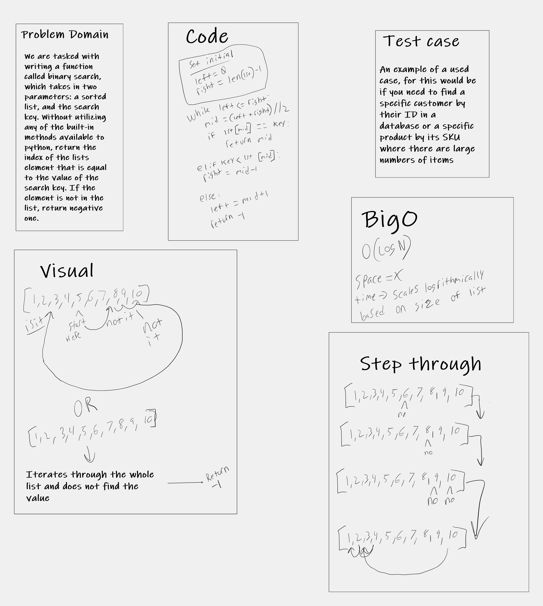

# Binary Search
<!-- Description of the challenge -->
This function was created to search through a list to find a value or if the value wasnt in the list, return a -1

## Whiteboard Process

## Approach & Efficiency
<!-- What approach did you take? Discuss Why. What is the Big O space/time for this approach? -->
I created a function that went to the middle of a list and logrithmically went through the list to find the correct value if it was there. It starts in the middle and clears the values to the right first, if none of them are it, it jumps to the left of the start point and repeats the process. If the value is not found, it returns a -1. 
