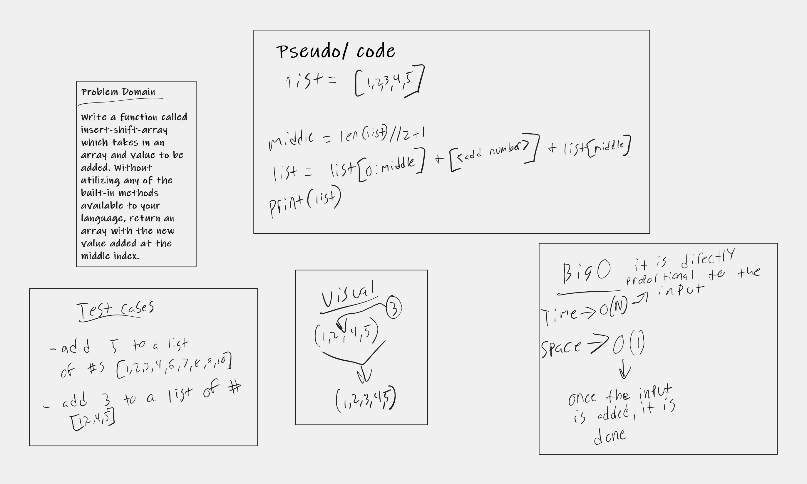

# Insert to Middle of an Array
<!-- Description of the challenge -->
This challenge was to add a value into the middle of an array!

## Whiteboard Process

## Approach & Efficiency
<!-- What approach did you take? Discuss Why. What is the Big O space/time for this approach? -->
I actually completely changed the way I drew the whiteboards. Its so time consuming to figure out how to lay it out on a computer and one of my classmates pointed out how much easier it would be on a tablet so thats what I did. Its a little messy but itll get better. I started with the problem domain and then visualized it. from there I broke down the code that could make it happen. the Big O for this was linear. Completely based on the input size for the process space and time.