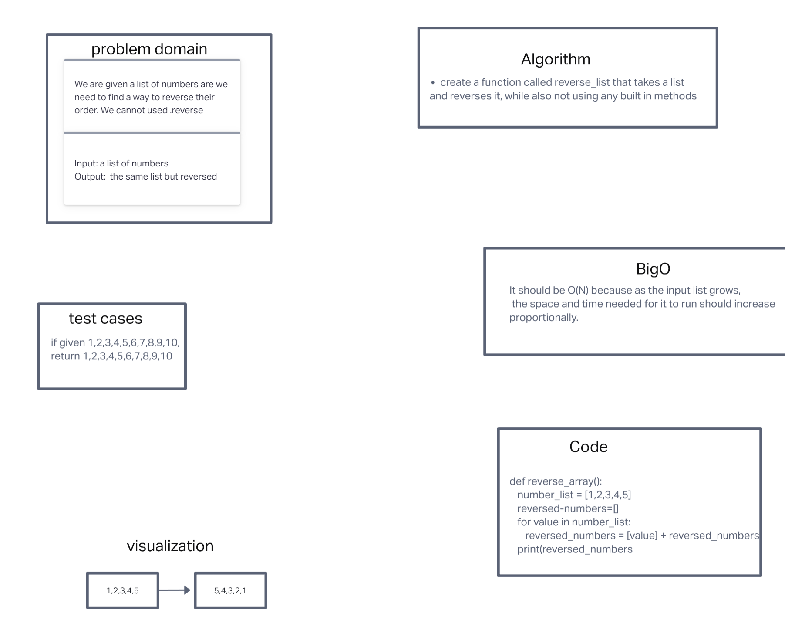

# Reverse an Array
The goal here was to take in an list and reverse its contents without using the built in reverse function

## Whiteboard Process
<!-- Embedded whiteboard image -->

## Approach & Efficiency
<!-- What approach did you take? Discuss Why. What is the Big O space/time for this approach? -->
I accomplished this by starting with the problem domain and then visualized it. Now that I could see the problem visually I devised code that would work the way it is needed to. The bigO for this would be O(N) because it will scale linearly with the inputs. 