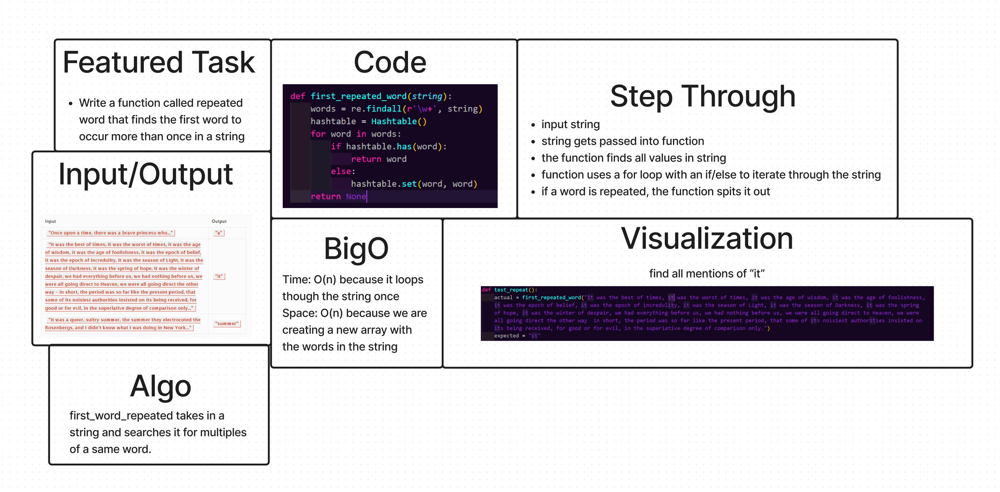

# Hashtable Repeated Word
<!-- Short summary or background information -->

## Challenge
<!-- Description of the challenge -->
Write a function called repeated word that finds the first word to occur more than once in a string

## Approach & Efficiency
<!-- What approach did you take? Why? What is the Big O space/time for this approach? -->
first_repeated_word: 
- Time: O(n) because we are looping through the string once
- space: O(n) because we are creating a new array with the words in the string
## API
<!-- Description of each method publicly available in each of your hashtable -->
first_repeated_word: this function takes in a string and returns the first repeated word in the string

## Whiteboard
<!-- Embedded whiteboard image -->

