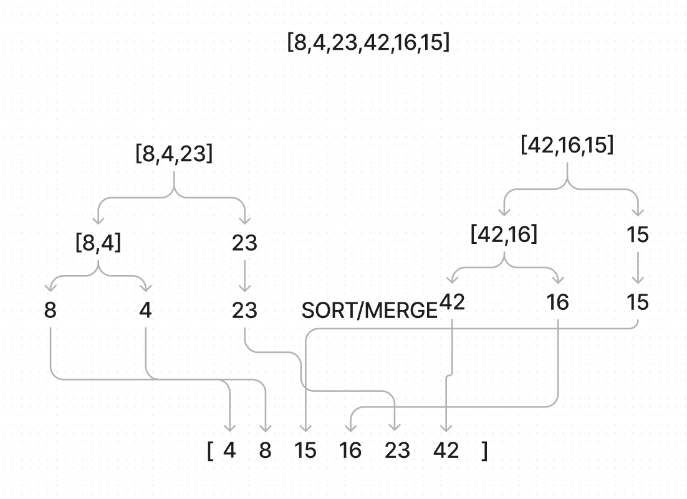

# Blog: Merge Sort

- merge sort is a algo that repeatedly splits the input list into smaller L/R lists until it has only 1 element. It then merges them while sorting them by the value. 

### Pseudo code provided:
`ALGORITHM Mergesort(arr)
    DECLARE n <-- arr.length
    if n > 1
      DECLARE mid <-- n/2
      DECLARE left <-- arr[0...mid]
      DECLARE right <-- arr[mid...n]
      // sort the left side
      Mergesort(left)
      // sort the right side
      Mergesort(right)
      // merge the sorted left and right sides together
      Merge(left, right, arr)
    ALGORITHM Merge(left, right, arr)
    DECLARE i <-- 0
    DECLARE j <-- 0
    DECLARE k <-- 0
    while i < left.length && j < right.length
        if left[i] <= right[j]
            arr[k] <-- left[i]
            i <-- i + 1
        else
            arr[k] <-- right[j]
            j <-- j + 1
        k <-- k + 1
    if i = left.length
       set remaining entries in arr to remaining values in right
    else
       set remaining entries in arr to remaining values in left`

## Solution:
`def merge_sort(input_list):
  n = len(input_list)
  if n > 1:
      mid = n//2
      left = input_list[:mid]
      right = input_list[mid:]
      merge_sort(left)
      merge_sort(right)
      i = j = k = 0
      while i < len(left) and j < len(right):
          if left[i] <= right[j]:
              input_list[k] = left[i]
              i += 1
          else:
              input_list[k] = right[j]
              j += 1
          k += 1
      while i < len(left):
          input_list[k] = left[i]
          i += 1
          k += 1
      while j < len(right):
          input_list[k] = right[j]
          j += 1
          k += 1
  return input_list`

## Step Through

1. `n = len(input_list)` The variable n is the length of the input list. 
2. `if n > 1` The merge sort algo only needs to be performed if the list has more than one element, otherwise its considered sorted.
3. `mid = n//2` The midpoint of the list is length/2
4. `left = input_list[:mid]` The left half of the list is obtained by slicing the list from the beginning to the midpoint.
5. right = same as left but reversed
6. `mergeSort(left)` The left half of the list is recursively passed into the merge sort function to be sorted.
7. `mergeSort(right)` ^
8. `i = j = k = 0` Three variables, i, j, and k are initialized to 0. They are used as indices to keep track of the current position in the left, right, and original arrays.
9. `while i < len(left) and j < len(right)` This while loop continues until all elements in the left and right arrays have been compared.
10. `if left[i] <= right[j]` If the element in the left list at index i is less than or equal to the element in the right list at index j, it is added to the original list at index k. else: If the element in the left list at index i is greater than the element in the right list at index j, the element in the right list is added to the original list.
11. `k += 1` The index k is moved to the next position in the original list. `i += 1` The index i is incremented to move to the next position in the left list. `j += 1` The index j is incremented to move to the next position in the right list.
12. `while i < len(left)` After all elements in the left and right arrays have been compared, this while loop adds any remaining elements in the left list to the original list. `while j < len(right)` After all elements in the left and right arrays have been compared, this while loop adds any remaining elements in the right list to the original list.

## Efficiency:
- Time: O(n log n) The list needs to be split many times and compared many times.
 - Space: O(n) The list is split into smaller lists and then merged back together. The space needed is the size of the original list.

## Visualization:
(provided by wikipedia)

(my example)

